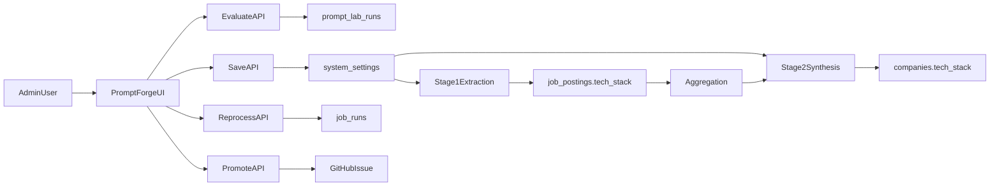

# Prompt Forge Guide

**Version:** 1.0  
**Last Updated:** 2026-03-06  
**Audience:** Admin users, product team, engineers, and development agents

---

## Overview

`Prompt Forge` is the admin-only lab for improving the AI prompts that power the tech stack pipeline and the weekly digest.

It serves two goals:

1. Help admins iteratively tune the prompts and Gemini model choices used in:
   - Stage 1: per-job technology extraction
   - Stage 2: company-level tech stack synthesis
   - Stage 3: weekly digest company summaries
2. Give the product and engineering team a safe operational system for evaluating, saving, replaying, reprocessing, and promoting prompt changes.

This document is intentionally split into two parts:

1. **User Manual**: operational guidance that can be referenced from the front end
2. **Technical Product Document**: implementation details for engineers and agents

---

## Quick Definition

### What Prompt Forge changes

- **Stage 1** reads each job description and writes structured fields, including `job_postings.tech_stack`
- **Stage 2** reads the per-job tech arrays and synthesizes a company-level stack into `companies.tech_stack`
- **Stage 3** reads weekly hiring evidence and writes role-focused company summaries into the weekly digest flow

### What Prompt Forge does not change

- It does not replace the underlying jobs collection pipeline
- It does not directly modify source code when you save a prompt
- It does not expose prompt editing to non-admin users

- It does not tune **per-job strategic insights** (the `analyzeJobAdvanced` pipeline used after collection to populate `strategic_insights`). To compare Gemini models for that path—for example `gemini-pro-latest` vs `gemini-3-flash-preview` or `gemini-flash-latest`—use the dev script `web/scripts/compare-job-analysis-models.ts` with shared historical and web context so both arms see identical inputs.

### Core product idea

Prompt changes should:

- be testable before going live
- be measurable
- propagate immediately through runtime settings
- optionally be promoted back into code defaults through a GitHub issue + codegen flow

---

## Part 1: User Manual

## Who Can Use It

Only users with `profiles.role = 'admin'` can access Prompt Forge.

Access is enforced in three places:

- Labs page visibility
- Prompt Forge page access
- Prompt Forge API routes

---

## Where To Find It

Open:

- `Labs`
- `Prompt Forge`

The lab is intentionally presented like a lightweight strategy game:

- `Forge`: write and tune prompts
- `Arena`: run battles against the current live config
- `Scoreboard`: compare results
- `Replay`: inspect previous runs
- `Ship Room`: save, reprocess, and promote

---

## What Each Stage Means

### Stage 1: Job Structure Extraction

Purpose:

- Reads a single job description
- Extracts specific technologies and related metadata
- Writes the result into `job_postings.tech_stack` and related fields

Use this when you want to improve:

- technology precision
- canonical naming
- fintech-specific vendor detection
- removal of generic terms like `cloud`, `API`, or `microservices`

### Stage 2: Company Tech Stack Synthesis

Purpose:

- Reads aggregated technology mentions from job postings
- Builds a narrative company tech stack for the company overview page

Use this when you want to improve:

- insight depth
- fintech architecture interpretation
- stack maturity commentary
- build-vs-buy, platform, and regulated-fintech perspective

### Stage 3: Weekly Digest Summary

Purpose:

- Reads weekly hiring evidence for one company
- Compares this week's roles against current open roles and year-to-date history
- Produces a simple, objective summary that distinguishes continuing patterns from genuinely new signals

Use this when you want to improve:

- continuity detection
- plain-language role summaries
- objective wording
- avoiding overclaimed novelty

---

## Supported Models

Prompt Forge currently supports these approved Gemini 3 models:

- `gemini-3-flash-preview`
- `gemini-pro-latest`

Recommended usage:

- Use `gemini-3-flash-preview` for fast extraction and quick iteration
- Use `gemini-pro-latest` when deeper synthesis quality matters more than speed

---

## Forge Tab

The `Forge` tab is where you edit the live candidate prompt.

### Controls

- Stage selector
- Company selector
- Arena selector
- Sample size for Stage 1
- Model selector
- Temperature
- Max output tokens
- Prompt editor

### Prompt linting

Prompt Forge checks for required placeholders before evaluation or save.

Required placeholders:

- Stage 1:
  - `{job_title}`
  - `{raw_department}`
  - `{description}`
  - `{categories}`
- Stage 2:
  - `{company_name}`
  - `{tech_data}`
  - `{total_jobs}`
  - `{period_start}`
  - `{period_end}`

If any placeholder is missing, the prompt cannot be saved or evaluated.

### Reset behavior

`Reset to live` restores the current draft back to the active runtime configuration.

---

## Arena Tab

The `Arena` tab is where candidate prompts compete against the current live configuration.

### Arena modes

For Stage 1:

- `Noise Gauntlet`
- `Signal Raid`
- `Boss Round`

For Stage 2:

- `Architect Arena`
- `Due Diligence`
- `Boardroom Boss`

### What a battle does

1. Loads the current live config as the baseline
2. Runs the candidate config against selected company data
3. Scores both results
4. Stores a replayable run in `prompt_lab_runs`

### What you see

- current live score
- challenger score
- score delta
- response latency
- structured diffs

Stage 1 diff view shows:

- techs added
- techs removed
- baseline vs challenger lists by job

Stage 2 diff view shows:

- categories
- technologies per category
- narrative summaries

---

## Scoreboard Tab

The `Scoreboard` tab summarizes quality metrics for the current challenger and recent runs.

### Main metrics

Stage 1 emphasizes:

- `Specificity`
- `Fintech Depth`
- `Canonical Names`
- `Signal Density`
- `Diversity`
- `Benchmark Fit`

Stage 2 emphasizes:

- `Coverage`
- `Insight Depth`
- `Category Variety`
- `Honest Uncertainty`
- `Anti-Generic`
- `Benchmark Fit`

### Leaderboard purpose

The leaderboard is not meant to be perfect science.

It is meant to answer:

- Is the new prompt better than the current one?
- Is it more specific?
- Is it more useful?
- Is it drifting toward generic output?

---

## Replay Tab

The `Replay` tab stores the recent history of evaluated runs.

Each replay captures:

- stage
- arena
- company
- model
- score
- metrics
- whether the run was saved live
- whether it was promoted to GitHub

Use Replay when:

- comparing champion vs challenger behavior
- reviewing regressions
- recovering a promising prior configuration

---

## Ship Room

The `Ship Room` turns evaluation into action.

### Save As Live Config

This writes the selected prompt and model into the production runtime configuration stored in Supabase `system_settings`.

Result:

- new extraction and synthesis calls immediately read the saved configuration from `system_settings`
- this updates live runtime behavior without modifying the repository or creating a GitHub change

### Reprocess

This re-runs Stage 1 against existing job descriptions using the active Stage 1 prompt.

Supported scope:

- selected company
- all companies
- optional job limit
- active jobs only toggle

Default behavior:

- the script and lab reprocess flows default to active jobs only
- inactive jobs are included only when the operator explicitly disables the active-only filter

Use reprocess when:

- you improved Stage 1 significantly
- you want the database to reflect the new extraction logic

### Promote To Code

This creates a GitHub issue containing a structured implementation brief so the approved runtime config can be synced back into the source-controlled default prompts in the codebase.

Optional behavior:

- trigger code generation workflow immediately

Use this when:

- the prompt/model is proven and should become the code default

---

## Recommended Admin Workflow

1. Start with Stage 1 if the extracted tech arrays look noisy or too generic.
2. Tune the prompt in `Forge`.
3. Run multiple `Arena` battles on different companies.
4. Review metrics and diffs in `Scoreboard`.
5. Save the best candidate as live config.
6. Run a targeted reprocess first.
7. If results look good, reprocess broader scope.
8. Promote the final version to code if it should become the new default.

---

## Known Operational Caveats

### Model demand spikes

Gemini requests can still fail during periods of high demand.

Current protections:

- retries on transient API failures
- request timeouts
- batch reprocess continues instead of hanging

### Empty `tech_stack` values after reprocess

Some jobs may still end with empty arrays because:

- the role truly contains no named technologies
- the model timed out
- the model returned transient `503` errors

### Scores are directional, not absolute truth

Prompt Forge scoring is useful for comparison, but it is not a perfect evaluation system.

Use it as decision support, not as the only decision-maker.

---

## Front-End Reference Summary

This block is written so it can be reused in product copy.

### Prompt Forge Summary

Prompt Forge is the admin-only lab for improving the AI prompts behind tech stack extraction and synthesis. It lets admins tune prompts, switch Gemini models, compare results against the current live config, review battle-style quality metrics, save winning settings instantly to production runtime settings in Supabase, reprocess existing job data, and optionally promote proven prompt changes back into source-controlled defaults in the repository.

### Short Tooltip Copy

Use Prompt Forge to test prompt changes before they go live, compare models, and safely roll out better extraction and synthesis quality.

---

## Part 2: Technical Product Document

## Product Intent

Prompt Forge exists because prompt quality is now part of product quality.

The goal is to make prompt operations:

- observable
- testable
- reversible
- admin-controlled
- runtime-configurable

This avoids hardcoding prompt changes directly into the product workflow every time the team wants to improve AI behavior.

---

## System Architecture



---

## Main Runtime Files

### Prompt configuration

- `web/lib/ai/prompt-config.ts`

Responsibilities:

- defines supported stages
- defines approved Gemini model options
- holds default prompt templates
- validates prompt payloads with Zod
- loads active configs from `system_settings`
- saves active configs back to `system_settings`

### Stage 1 runtime

- `web/lib/analysis/structure.ts`
- `web/lib/jobs/processor.ts`

Responsibilities:

- read Stage 1 config
- build prompt from template
- run Gemini extraction
- validate returned JSON
- write `job_postings.tech_stack` and related silver-layer fields

### Stage 2 runtime

- `web/lib/ai/tech-stack-extraction.ts`
- `web/lib/ai/tech-stack-aggregation.ts`
- `web/app/api/companies/[id]/tech-stack/route.ts`
- `web/lib/jobs/runner.ts`

Responsibilities:

- aggregate per-job tech signals
- run synthesis prompt
- produce company-level categories and narrative summaries
- write `companies.tech_stack`

### Prompt Forge UI

- `web/app/(dashboard)/labs/prompt-forge/page.tsx`
- `web/components/labs/PromptForgeLab.tsx`

Responsibilities:

- render the admin lab
- manage local draft state
- call evaluate/save/reprocess/promote endpoints
- display diffs, scorecards, and replay history

### Prompt Forge server logic

- `web/lib/labs/prompt-forge.ts`
- `web/lib/labs/prompt-forge-benchmarks.ts`
- `web/lib/auth/admin.ts`

Responsibilities:

- scoring
- benchmark handling
- replay persistence
- reprocess orchestration
- GitHub promotion brief generation
- shared admin guards

### Prompt Forge APIs

- `web/app/api/admin/labs/prompt-forge/evaluate/route.ts`
- `web/app/api/admin/labs/prompt-forge/save/route.ts`
- `web/app/api/admin/labs/prompt-forge/reprocess/route.ts`
- `web/app/api/admin/labs/prompt-forge/promote/route.ts`

---

## Data Model

### `system_settings`

Active runtime configs are stored under:

- `job_structure_ai`
- `tech_stack_ai`

Each value contains:

- `stage`
- `model`
- `promptTemplate`
- `temperature`
- `maxOutputTokens`
- `version`
- optional `notes`
- optional `benchmarkScore`

### `prompt_lab_runs`

Created by migration:

- `web/supabase/migrations/20260306110000_prompt_forge.sql`

Purpose:

- stores evaluation history
- tracks candidate vs baseline outputs
- supports replay and auditability

Important fields:

- stage
- arena
- company
- model
- candidate/baseline config
- candidate/baseline output
- metrics
- score
- saved_as_active
- promotion issue metadata

### `job_runs`

Used for Stage 1 reprocessing operations.

Prompt Forge stores reprocess metadata under `details`, including:

- `operation`
- `totalJobs`
- `processedJobs`
- `failedJobs`
- `activeOnly`
- `limit`
- `model`
- `version`

---

## Reprocess Flow

### API path

`POST /api/admin/labs/prompt-forge/reprocess`

### Runtime behavior

1. Create a `job_runs` record for the reprocess
2. Load active Stage 1 config
3. Query eligible jobs with descriptions
4. Process jobs in batches
5. Update `job_runs.details.processedJobs`
6. Complete the run with final counts

### Standalone script

For operational or manual runs:

- `web/scripts/reprocess-job-structures.ts`

Example usage:

```bash
cd web
npx tsx --env-file=.env.local scripts/reprocess-job-structures.ts
npx tsx --env-file=.env.local scripts/reprocess-job-structures.ts --company=<uuid>
npx tsx --env-file=.env.local scripts/reprocess-job-structures.ts --limit=100
npx tsx --env-file=.env.local scripts/reprocess-job-structures.ts --include-inactive
```

### Hardening already in place

- request timeout protection on Gemini calls
- transient retry behavior
- progressive input shortening when JSON output appears truncated
- Stage 1 output is runtime-capped to a compact JSON budget even if a saved config specifies a larger token ceiling
- batched progress updates
- reprocess survives individual row failures

---

## Evaluation Design

Prompt Forge uses two layers of evaluation:

### 1. Heuristic scoring

Stage 1:

- specificity
- fintech depth
- canonical naming
- signal density
- diversity

Stage 2:

- coverage
- insight depth
- category variety
- uncertainty handling
- anti-generic narrative quality

### 2. Benchmark fixtures

Defined in:

- `web/lib/labs/prompt-forge-benchmarks.ts`

These are curated example cases with expected:

- included technologies
- excluded noisy terms
- category expectations
- required narrative terms

Use benchmark fixtures when:

- adjusting the scoring model
- adding new arena types
- investigating regressions

---

## Promotion To Code

Prompt Forge does **not** require code generation for runtime changes.

Instead:

1. Save writes the prompt/model into `system_settings`
2. Runtime behavior changes immediately
3. `Promote to code` is optional and used to sync approved defaults into source

### Promotion path

Implemented in:

- `web/lib/labs/prompt-forge.ts`
- existing GitHub helpers in `web/lib/github.ts`

Output:

- a structured GitHub issue with exact instructions
- optional trigger of the existing codegen workflow

This is intentionally secondary to runtime propagation.

---

## Security And Access Model

### Admin gating

Admin access is enforced by:

- `web/lib/auth/admin.ts`
- labs navigation filtering
- page-level admin check
- API-level admin check

### Model restrictions

Model values are restricted by schema validation in `web/lib/ai/prompt-config.ts`.

Only approved Gemini 3 models should be accepted.

### Prompt validation

Prompt save/evaluate requests are blocked if required placeholders are missing.

---

## Operational Notes

### If prompt configs appear broken

Check:

- `system_settings.job_structure_ai`
- `system_settings.tech_stack_ai`
- prompt placeholders
- prompt length
- model value

If configs are malformed, runtime falls back to code defaults.

### If reprocess gets stuck

Check:

- Gemini `503` demand spikes
- request timeout logs
- `job_runs.details`
- number of rows with empty `tech_stack`

### If company summaries remain generic

Check in order:

1. Are Stage 1 arrays too vague or sparse?
2. Is the Stage 2 prompt too broad?
3. Is the selected model too weak for the synthesis task?
4. Are the benchmark fixtures missing the nuance you care about?

---

## Suggested Next Improvements

### Product

- add a dedicated “retry failed reprocess rows” action
- let admins compare two saved replays directly
- surface benchmark fixture names in the UI

### Engineering

- move large reprocess runs to a more durable background execution path
- persist more detailed failure counts during reprocess
- add typed benchmark result storage if historical evaluation becomes important

### Prompt quality

- expand benchmark coverage for non-engineering but still tech-significant roles
- add company-type-aware synthesis benchmarks
- evaluate whether some Stage 2 scenarios should default to `gemini-pro-latest`

---

## Summary

Prompt Forge turns prompt improvement from an ad hoc engineering task into an operational product workflow.

For admins, it is a practical tuning tool.

For engineers, it is a runtime prompt-ops system with validation, replay history, reprocessing, and promotion hooks.

For development agents, this document should be the fastest way to understand:

- what Prompt Forge is
- how it fits into the tech stack pipeline
- where the logic lives
- how to safely extend it

